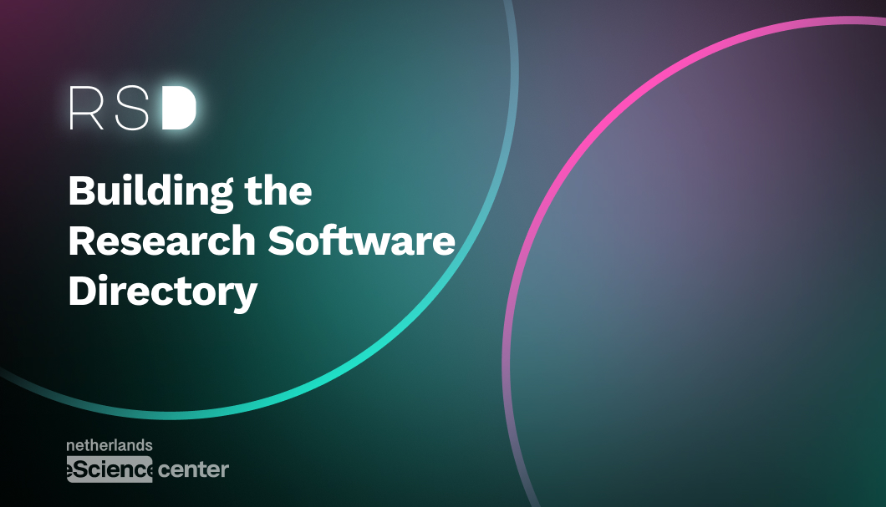

# NLeSC Project Template

A GitHub template for new Netherlands eScience Center research software projects.

Use this repository when starting a new project so the basics are present from day one: license, citation, Zenodo metadata, documentation structure, architecture notes, release process, Research Software Directory preparation, and project quality checklists.

## Why this exists

Research software often starts with a scientific question and grows into a tool, package, workflow, dashboard, model, API, or platform. The early repository decisions matter. They shape whether the software can be understood, cited, archived, released, reused, maintained, and adopted after the project ends.

This template helps project teams think big, then make the scoped version possible.

## What is included

- Apache 2.0 license
- `CITATION.cff` for software citation
- `.zenodo.json` for Zenodo archive metadata
- `codemeta.json` for machine-readable research software metadata
- README structure with badges and placeholders
- Contribution, governance, security, and code of conduct files
- Architecture documentation and ADR starter
- Software management plan starter
- RSD entry preparation checklist
- Release and DOI checklist
- GitHub issue and pull request templates
- GitHub Actions metadata validation workflow
- Project setup and handover checklist

## Use this template

1. Click **Use this template** on GitHub, or create a new repository from this template.
2. Replace all placeholders marked with `TODO`.
3. Update repository topics in GitHub settings.
4. Decide the project maturity target: exploration, pilot, consolidation, or ecosystem adoption.
5. Enable Zenodo archiving for the repository.
6. Prepare a Research Software Directory entry once the project has a stable public description.
7. Create the first release when the software is usable and citable.

## Recommended GitHub topics

Use topics that make the project discoverable by humans and machines. Start with:

- `research-software`
- `netherlands-escience-center`
- `open-science`
- `fair-software`
- `reproducible-research`
- domain tags, for example `climate`, `life-sciences`, `digital-humanities`, `geospatial`
- technology tags, for example `python`, `r`, `javascript`, `workflow`, `machine-learning`, `visualization`

See `docs/repository-topics.md` for more guidance.

## Badges

Replace `OWNER/REPOSITORY` and add badges that are true for your project.

## Project checklist

Before active development:

- [ ] Replace README placeholders.
- [ ] Choose clear repository topics.
- [ ] Add project team and affiliations to `CITATION.cff` and `.zenodo.json`.
- [ ] Decide the software shape: package, app, workflow, dataset tooling, API, model, or other.
- [ ] Write the first architecture note in `docs/architecture.md`.
- [ ] Create the first ADR in `docs/decisions/` for major choices.
- [ ] Decide where user documentation will live.
- [ ] Decide what “good enough for first use” means.
- [ ] Decide what should happen when the original RSE leaves.

Before first public release:

- [ ] Tests or validation checks exist for the core workflow.
- [ ] Installation or usage instructions are tested from a clean environment.
- [ ] License is correct.
- [ ] Citation metadata validates.
- [ ] Zenodo is connected.
- [ ] Release notes are written.
- [ ] RSD entry draft is ready.
- [ ] Known limitations are documented.

Before handover:

- [ ] Maintainers are named.
- [ ] Open issues are triaged.
- [ ] Architecture and deployment notes are current.
- [ ] Release process is documented.
- [ ] The next maintainer can run, test, and release the software.

## Sources and inspiration

This template draws on common patterns from NLeSC repositories and related research software practice, including:

- NLeSC Software Development Guide
- NLeSC Python Template
- NLeSC Repository Template
- NLeSC GitHub Template
- DroneML/DroneAtlas metadata and release setup
- Citation File Format
- Zenodo GitHub integration
- Research Software Directory preparation

## License

Apache License 2.0. See `LICENSE`.
