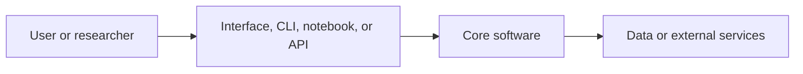

# Architecture

Use this document to explain the technical shape of the project.

## Context

- Research question:
- Users:
- Data sources:
- Expected lifetime:
- Deployment target:
- Maintenance owner:

## System overview

TODO: Add a short explanation and a diagram.

## Main components

| Component | Purpose | Owner | Notes |
| --- | --- | --- | --- |
| TODO | TODO | TODO | TODO |

## Key decisions

Link to Architecture Decision Records in `docs/decisions/`.

## Data flow

TODO: Describe inputs, processing steps, outputs, storage, and privacy constraints.

## Quality attributes

Describe what matters most:

- correctness
- reproducibility
- usability
- performance
- maintainability
- portability
- security
- sustainability

## Known risks

- TODO

## Handover notes

What should a future maintainer know first?
